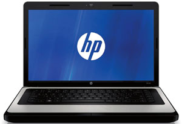
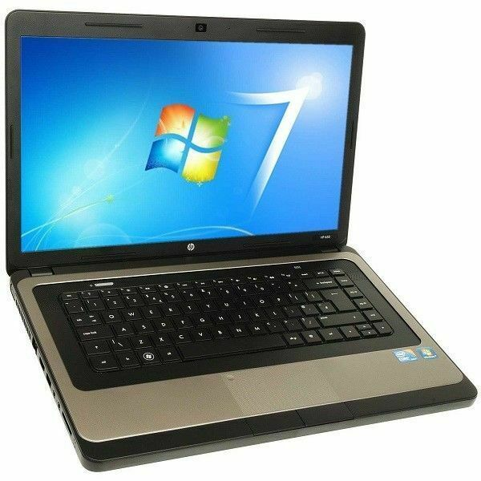
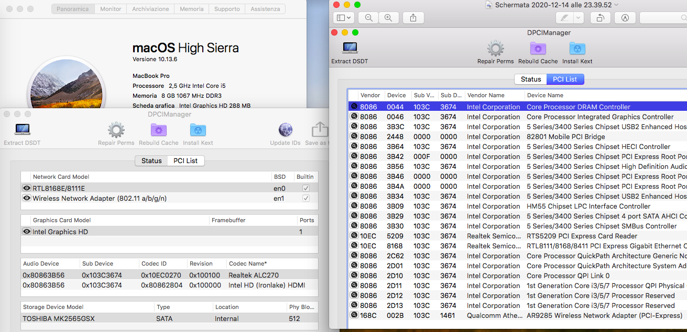
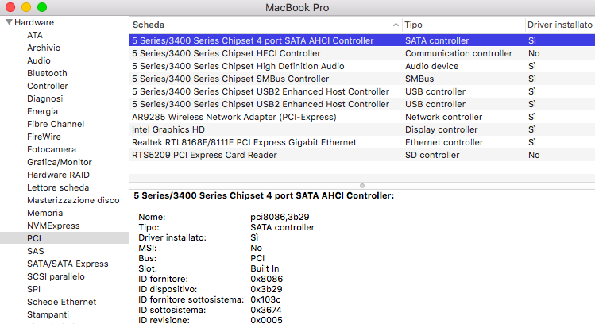
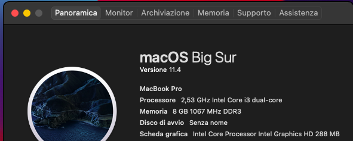

# HP630-CPU-Arrandale-Bios-Legacy-

### Computer Spec:

| Component        | Brank                              |
| ---------------- | ---------------------------------- |
| CPU              | Intel i3 M380                      |
| iGPU             | Intel® Graphics HD                 |
| Display          | 1366x768                           |
| Audio            | Realtek ALC270                     |
| Ram              | 8Gb ddr3 1067 Mhz                  |
| SSD              | Kingston A400 512gb                |
| SmBios           | MacbookPro 6,2                     |
| BootLoader       | OpenCore                           |

## Device

 

### What works:

- [x] Intel HD iGPU
- [x] ALC270 Internal Speakers
- [x] All USB Ports 
- [x] Realtek RTL8111 LAN
- [x] ACPI Battery

### NO works:

- [x] Brightness Key
